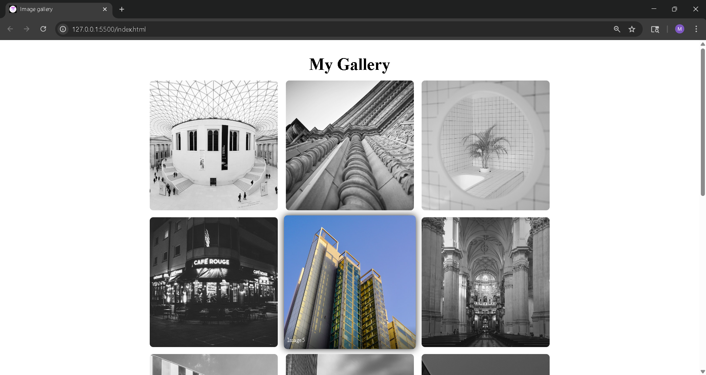

# 🖼️ Image Gallery — HTML & CSS


A clean and responsive **Image Gallery** built with **pure HTML & CSS only** — no JavaScript, no frameworks, no libraries.

---

##  Live Demo

👉 [View Live on GitHub Pages](https://github.com/AI-RISHVA/image-gallery-app.git)

---

## 📸 Preview



---

##  Features

-  **Grayscale → Color** effect on hover
-  **Smooth caption reveal** with gradient overlay at bottom
-  **Responsive 3-column layout** using Flexbox
-  **Card-style design** with rounded corners
-  **No JavaScript** — pure CSS transitions & filters
-  Subtle **scale animation** on hover

---

##  Tech Stack

| Technology | Usage |
|------------|-------|
| HTML5 | Page structure, semantic `<figure>` & `<figcaption>` tags |
| CSS3 | Flexbox layout, hover effects, transitions, filters |

---

## 📂 Project Structure

```
image-gallery-app/
│
├── index.html         # Gallery HTML structure
├── style.css          # All styling & hover effects
├── favicon.png        # Browser tab icon
├── preview.png        # README preview screenshot
│
├── image1.jpg
├── image2.jpg
├── image3.jpg
├── ...
└── image15.jpg        # 15 gallery images total
```

---

##  Getting Started

### View Locally
1. Clone the repository
```bash
git clone https://github.com/AI-RISHVA/image-gallery-app.git
```

2. Open in browser
```bash
cd image-gallery-app
open index.html
```

No installation needed! ✅

---

## What I Learned

- Using CSS `filter: grayscale()` for image effects
- Positioning `figcaption` absolutely inside a `figure` card
- Creating smooth gradient overlays with `rgba` for text readability
- Debugging CSS specificity and selector issues
- Responsive layout with Flexbox and percentage-based widths

---

##  Connect With Me

[](https://www.linkedin.com/in/rishva-davariya-1a609b372)
[](https://github.com/AI-RISHVA)

---

##  License

This project is open source and available under the [MIT License](LICENSE).

---

 **If you liked this project, give it a star!**